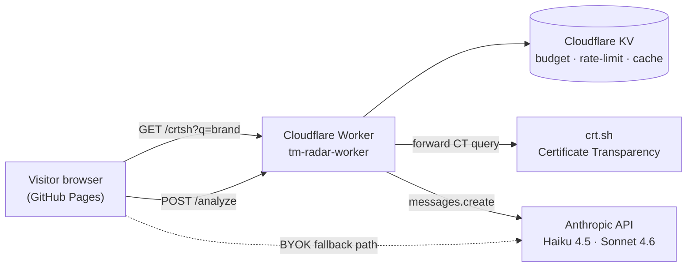

# TM Radar

**Real-time cybersquatting detection (typosquats, homoglyphs, combos) via Certificate Transparency + AI-powered UDRP/EUTMR pre-triage.**

[](https://sahil-singh-llm.github.io/tm-radar/)
[](LICENSE)
[](#what-this-tool-detects-cybersquatting)
[](#)
[](https://sahil-singh-llm.github.io/tm-radar/)

<p align="center">
  
</p>

---

TM Radar is a purely client-side React application that polls public Certificate Transparency
logs for newly issued TLS certificates matching a watched brand, scores each domain against
cybersquatting heuristics, and — for the truly suspicious ones — fetches the live website and
produces a structured pre-triage memo mapping the observed signals to UDRP Paragraph 4 and
EUTMR Art. 9(2) limbs for attorney review.

## What this tool detects: cybersquatting

> **Terminology note.** What this tool detects is the bad-faith registration of **domain names**
> that mimic an existing mark — the precise term is **cybersquatting** (the abusive
> domain-name registration the UDRP was created to address; cf. **15 U.S.C. § 1125(d) ACPA**),
> with typosquatting, homoglyph attacks, combosquatting, and keyword injection as recognized
> subtypes.
> *Trademark squatting* in strict legal usage refers to the bad-faith registration of a
> **trademark** itself by someone other than the legitimate brand owner — a related but distinct
> problem this tool does not address. The repo title "TM Radar" frames the use case from the
> brand-protection perspective; the technical detection runs on domain identifiers.

Common variants:

- **Typosquatting** — `nikee.com`, `paypa1.com`
- **Homoglyph attacks** — `nіke.com` (Cyrillic `і` instead of Latin `i`)
- **Combosquatting** — `nike-support.xyz`, `get-nike.top`
- **Keyword injection** — `paypal-secure-login.com`
- **Suspicious-TLD variants** — `nike.tk`, `spotify.click`

Cybersquatters typically use these domains to phish customers, distribute counterfeit goods, or
extort the legitimate brand owner. Catching the registration on day one — before the domain is
ever served to a real user — is the difference between a routine UDRP filing and a costly
enforcement campaign.

## How it works

1. **Poll** — Queries [crt.sh](https://crt.sh) (Sectigo's public Certificate Transparency log
   index) every 30 seconds for entries whose Subject Alternative Names contain the watched
   brand string. crt.sh's monotonic `id` cursor lets the client emit only newly-inserted
   certificates on each subsequent poll. This is brand-targeted polling rather than a
   firehose — drastically lower noise, and resilient (Calidog's public Certstream WebSocket has
   been intermittently down since 2023).
2. **Brand context** — On startup, the app does a single Wikidata SPARQL lookup against the
   brand string and, if a matching business/brand entity exists, surfaces its industry,
   inception year, and country to the LLM prompt as community-curated background context —
   explicitly not a register-verified right.
3. **Score** — Each new domain is run through a multi-signal detection engine:
   - Normalized Levenshtein distance against the brand name
   - Homoglyph character substitution (Cyrillic, accented Latin, digit lookalikes)
   - Combosquatting (brand as substring with affixes)
   - Suspicious-keyword injection (`support`, `login`, `secure`, …)
   - Suspicious-TLD bonus (`.tk`, `.xyz`, `.click`, …)
4. **Fetch** — Domains scoring above the threshold trigger a website-content fetch via CORS
   proxy and a homepage screenshot via [microlink.io](https://microlink.io)'s free tier (server-
   side headless-Chrome rendering). Most freshly issued certificates point to nothing yet —
   that's expected; both fetches handle null gracefully.
5. **Analyze** — An LLM produces a structured pre-triage memo covering:
   - **Sign similarity** — squatting technique observed (typo / homoglyph / combo / TLD / keyword / mixed)
   - **Goods & services indicators** — apparent operating market, when the site is reachable
   - **Confusion-risk indicator** — high / medium / low / cannot be assessed (a triage proxy;
     "likelihood of confusion" as a doctrinal conclusion under *Sabel/Canon/Lloyd* is reserved
     for the UDRP/EUTMR mapping below)
   - **UDRP Paragraph 4(a) limbs** — explicit mapping to ¶ 4(a)(i)–(iii), with ¶ 4(b)(i)–(iv)
     bad-faith circumstances referenced where applicable
   - **EUTMR Art. 9(2) limbs** — explicit mapping to 9(2)(a)–(c)
   - **Indicators for legal review** — investigative steps for the reviewing attorney
     (registrant identity via WHOIS/RDAP, prior use, registrant's portfolio, registrar
     jurisdiction)

   The output is framed as decision support for a qualified trademark attorney, not as legal
   advice or an enforcement recommendation. Single-provider by design — **Anthropic Claude
   Sonnet 4.6** — with the prompt tuned to Claude's output style; a multi-provider abstraction
   is intentionally out of scope without an accompanying cross-provider evaluation suite.

The analysis runs in two stages: an immediate domain-only assessment as soon as the domain is
flagged, automatically refined with goods & services data once the website is fetched.

**Visualization.** Observed and flagged domains plot on a live radar sweep — positioned by
severity ring (critical innermost, low outermost), color-coded by severity band. Gives an
at-a-glance read of detection volume and threat distribution without scrolling alert cards.

## Detection Algorithms

| Signal | Description | Score range |
| --- | --- | --- |
| Levenshtein | Normalized edit distance on the leftmost label | up to 95 |
| Homoglyph | Reverse-mapping of Cyrillic / digit / accent variants to Latin | 80–98 |
| Combosquatting | Brand as substring; score decays with extra characters | 70–95 |
| Keyword injection | Brand + a high-risk keyword like `support` or `login` | 95 |
| Suspicious TLD | `+20` bonus when paired with another signal | additive |

Severity bands: `low` 50–64, `medium` 65–79, `high` 80–91, `critical` 92+.

## Legal Framework

The prompt anchors the LLM output to concrete provisions — UDRP Paragraph 4(a)(i)–(iii) limbs,
¶ 4(b)(i)–(iv) bad-faith circumstances, EUTMR Art. 9(2)(a)–(c) infringement limbs, with WIPO as
the most-used ICANN-approved UDRP provider — rather than free-associating around "bad faith".
Note that Art. 9(2) applies to **registered EU trade marks**; unregistered signs fall under
national law or Art. 8(4) EUTMR. See "Deliberate Simplifications" for what is *not* modeled.

> ⚠ This tool identifies *potential* indicators of cybersquatting for investigative purposes
> only. It does not constitute legal advice. Always consult a qualified trademark attorney
> before initiating any enforcement action.

## Deliberate Simplifications

The following are intentionally **out of scope**. A production brand-protection product would
need to address each of them; this tool deliberately stops short to keep the demonstration
focused on the detection-plus-structured-analysis pipeline.

- **Goods/services similarity** — Art. 9(2)(b) EUTMR is not assessed. Nice class headings are
  not the legal test (cf. CJEU *Canon* C-39/97; *IP Translator* C-307/10); the tool cannot
  evaluate whether the registrant's actual goods or services overlap with those of the
  protected mark.
- **Reputation protection** — Art. 9(2)(c) EUTMR (marks with a reputation; cf. *General Motors*
  C-375/97) is not modeled. The reputation status of the input mark is assumed unknown. Note
  this is distinct from "well-known marks" under Paris Convention Art. 6bis / TRIPS Art. 16,
  which is also out of scope.
- **Priority and geographic scope** — first-to-file dates, EU vs. national vs. Madrid scopes,
  and prior-use defenses are all ignored.
- **Multi-brand portfolios** — single-brand monitoring only. A real IP department typically
  watches dozens to hundreds of marks simultaneously.
- **Mark register verification** — Wikidata is queried only for soft brand context (industry,
  inception year, country); no official register (EUIPO, USPTO, WIPO Madrid, DPMA) is consulted.
  Register verification — existence, status, ownership, classes, priority — remains attorney
  work.
- **WHOIS / RDAP enrichment** — registrant identity, prior registrations, and pattern of bad
  faith would all require integration with WHOIS APIs (most paid or rate-limited).
- **Persistent case management** — alerts vanish on page refresh. A production product needs a
  database, audit trail, and evidence packaging for legal proceedings.
- **UPL positioning** — the prompt is framed as pre-triage; jurisdiction-specific
  unauthorized-practice-of-law disclaimers would need to be added before any commercial
  deployment, particularly in Germany under the **RDG (Rechtsdienstleistungsgesetz)** and in
  Austria under the **RAO (Rechtsanwaltsordnung)**.
- **Evaluation rigor** — output quality is currently measured anecdotally. A labeled
  UDRP-decision fixture set with regression tests would be the next step before any
  commercial deployment.
- **Evidence-grade screenshot capture** — homepage thumbnails come from microlink.io's free
  tier (~50 requests/day, watermarked CDN URLs). For UDRP/WIPO submissions the panel/provider
  expects timestamped, hash-anchored, full-page captures of every visited path; that requires
  a self-hosted Puppeteer cluster (Cloudflare Workers Browser Rendering or similar) plus a
  crawl strategy and is explicitly out of scope here.
- **EU GDPR — Google Fonts in-line loading** — *Inter* and *JetBrains Mono* are loaded
  directly from Google's CDN, which transmits visitor IPs to Google. The Landgericht München I
  ruled in *3 O 17493/20* (20 January 2022) that processing visitor IPs this way without
  consent lacks a legal basis under **Art. 6(1) GDPR** (€100 damages awarded under
  § 823(1) BGB). The court did not reach the Chapter V transfer question. For EU/EEA
  deployment, fonts should be self-hosted or loaded behind a consent gate. Documented in
  [THIRD_PARTY_LICENSES.md](THIRD_PARTY_LICENSES.md#web-fonts).

## Roadmap

- **RDAP enrichment** — registrant identity, registrar, and creation date pulled per alert via the standardized RDAP protocol.
- **Wayback first-archive timestamp** — earliest Internet Archive capture of the suspicious domain as a registration-age signal.
- **URLhaus reputation flag** — cross-check each flagged domain against abuse.ch's URLhaus malware/phishing feed.
- **DNS / MX active-mailflow indicator** — surface MX-record presence and resolver liveness as a "weaponized vs. parked" signal.
- Official trademark register integration (TMview / EUIPO eSearch / USPTO TSDR) — pending stable public APIs with CORS support.

## Setup

### Local development

```bash
npm install
npm run dev          # vite dev server on :5173
npm run test         # vitest (detection heuristics — 25 cases)
npm run typecheck    # tsc -b
npm run build        # production bundle into dist/
npm run deploy       # publishes dist/ to gh-pages
```

Open [http://localhost:5173](http://localhost:5173). With no Cloudflare worker configured the
client falls back to BYOK-only mode — paste your own
[Anthropic API key](https://console.anthropic.com) (stored only in `sessionStorage`, sent
directly to Anthropic, never via any server).

### Cloudflare Worker (production proxy)

For the worker-mode default — visitors don't need their own Anthropic key — deploy the proxy:

```bash
cd worker
npm install
wrangler login
wrangler kv namespace create TM_RADAR_KV    # paste returned id into wrangler.toml
wrangler secret put ANTHROPIC_API_KEY        # your operator key
wrangler deploy
```

Then point the client at the deployed worker:

```bash
echo "VITE_WORKER_URL=https://tm-radar-worker.<your-subdomain>.workers.dev" > .env.production
npm run deploy
```

The worker enforces an `Origin` allowlist (set via `ALLOWED_ORIGINS` in `wrangler.toml`),
per-IP daily rate limits, a hard daily $-budget cap, a 24-hour per-domain response cache, and
routes Stage-1 (domain-only) requests to Haiku 4.5 and Stage-2 (enriched with website content)
to Sonnet 4.6. When the budget is exhausted or the worker is unreachable, the client silently
falls back to canned per-technique analyses for that alert so the demo never breaks.

## Architecture



The worker is the single point of egress for the paid (Anthropic) and rate-limited (crt.sh)
APIs; the browser only talks to the worker. The dashed BYOK path opens when a visitor supplies
their own Anthropic key — calls then go directly browser → Anthropic, never touching the
worker.

### Repo layout

```
src/
├── App.tsx                — top-level state machine: setup ↔ monitor
├── components/
│   ├── SetupScreen.tsx    — onboarding form, threshold-info modal, BYOK toggle
│   ├── Monitor.tsx        — orchestrates stream → detection → worker/BYOK analysis
│   ├── DomainAlert.tsx    — compact alert card with expand-for-details
│   ├── Radar.tsx          — animated radar visualization of observed + flagged domains
│   └── StatsBar.tsx       — counters + connection status
└── lib/
    ├── crtsh.ts           — crt.sh polling: worker proxy first, public proxies as fallback
    ├── screenshot.ts      — microlink.io homepage capture for evidence preview
    ├── detection.ts       — Levenshtein, combosquatting, keyword, TLD, homoglyph scoring
    ├── detection.test.ts  — vitest fixtures for detection heuristics
    ├── homoglyphs.ts      — character substitution map + normalization
    ├── fetcher.ts         — multi-proxy CORS website fetch
    ├── claude.ts          — Anthropic client (BYOK) + worker-proxy client + rate limiter
    ├── brandProfile.ts    — Wikidata SPARQL brand-context lookup
    └── demoAnalysis.ts    — canned per-technique analyses (worker-failure failover)

worker/                    — Cloudflare Worker (TypeScript on Workers Runtime)
├── src/
│   ├── index.ts           — request routing, validation, KV ops, CORS
│   ├── anthropic.ts       — Claude call with system-prompt cache_control breakpoint
│   └── types.ts           — shared request/response/env types
└── wrangler.toml          — KV binding, allowed origins, budget + rate limits, model IDs
```

## Scope and Audience

This is a Legal Engineering **showcase**, not a commercial brand-protection product — see
[Deliberate Simplifications](#deliberate-simplifications) for what production monitoring would
additionally require. The project deliberately stops at the proof-of-concept layer to
demonstrate end-to-end thinking across the legal-tech stack: real-time CT-log ingest,
multi-vector detection heuristics, structured legal prompting against concrete UDRP / EUTMR
provisions, attorney-facing output framing, and explicit limit awareness.

Intended audience: IP and brand-protection teams evaluating where AI fits into early-stage
cybersquatting triage.

## License & Attribution

The MIT License (see [LICENSE](LICENSE)) covers all original source code in this repository.

Bundled third-party dependencies retain their respective licenses; external services accessed
at runtime are governed by their providers' terms. The full inventory — bundled dependencies,
build-time tooling, runtime services (crt.sh, Anthropic, Microlink, Google Fonts, …),
algorithms and data sources — is documented in
[THIRD_PARTY_LICENSES.md](THIRD_PARTY_LICENSES.md).

Run `npm run licenses` to verify the production-bundle inventory against the current
`package-lock.json`.
